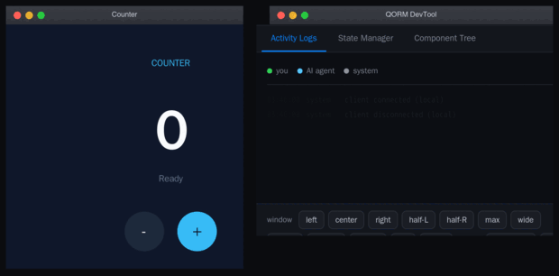
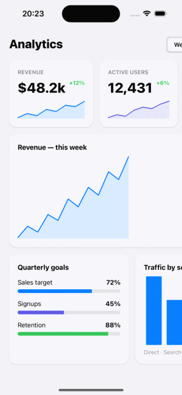
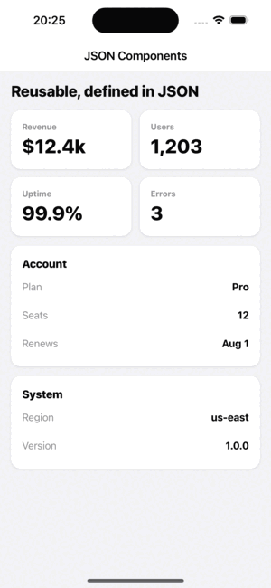
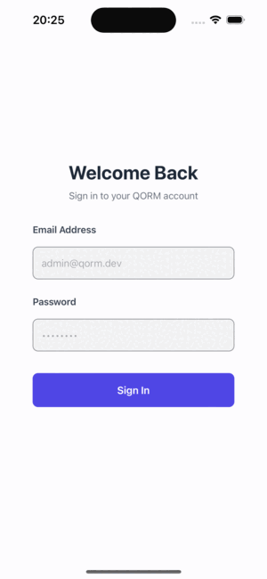
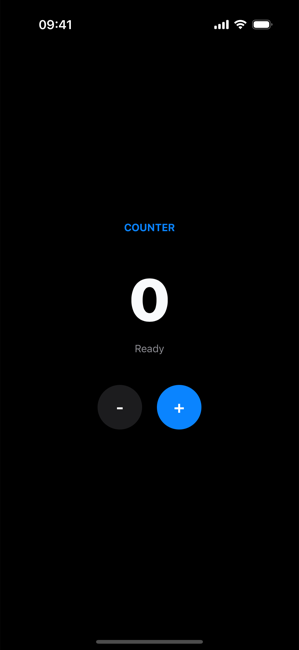
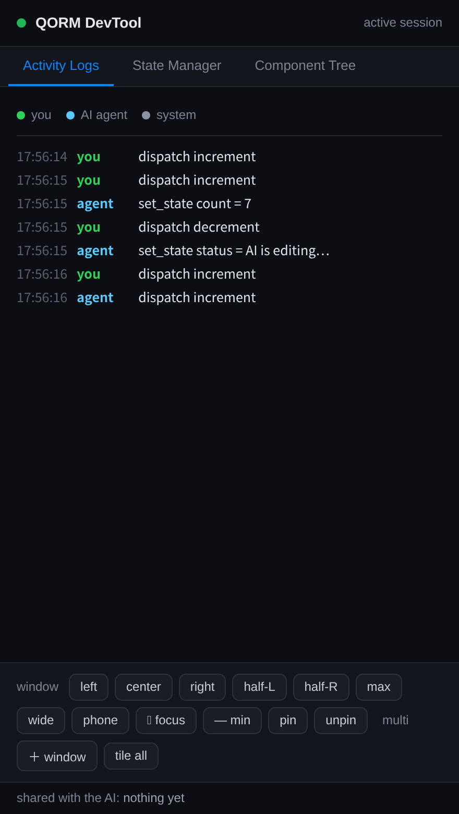

<!-- data-lang-nav --><p align="right"><b>English</b> · <a href="README.zh.md">中文</a></p>

# QORM

**Build UI apps with your AI assistant — together, live.** QORM is an
agent-native declarative-UI runtime: describe a UI as small, language-neutral
JSON, and your AI (Claude, Cursor, …) can **scaffold, edit, run, and verify** it
while you collaborate on the same running app in real time — you click, it sees
you; it edits, you watch it happen.

<p align="center"></p>

<sub>The GIF was recorded by QORM itself — the AI drove the edits over MCP and `qorm
shot` captured each frame via WebKit. No browser automation; see
[`scripts/record-demo.sh`](scripts/record-demo.sh).</sub>

### The same app, packaged for iOS

<p align="center">
  
  
  
  
</p>

<sub>Real iOS builds (`qorm package -p ios`), captured in the iOS Simulator. The
same JSON app also runs on web / Android / desktop / mini-program.</sub>

Under the hood the default build is pure Go — it runs the app live in the browser, renders
a static HTML snapshot, ed25519-signs it into a distributable bundle, serves it
over-the-air with rollback, exposes it to agents over MCP, and packages it for
web / iOS / Android / desktop / mini-program — cross-compiled from any machine.

Developed in collaboration with Claude (Anthropic) — fitting, since human-AI
collaboration is QORM's whole premise.

## Build with your AI assistant

QORM is agent-native: point your AI coding assistant (Claude Code, Claude Desktop,
Cursor, Windsurf, …) at it and have it **scaffold, edit, run, and verify** QORM
apps — then collaborate with you on a live app in real time. You click, it sees
you (`qorm_activity`); it edits, you see an **"AI edited"** toast. Set it up once:

```sh
go install github.com/qorm/qorm/cmd/qorm@latest
claude mcp add qorm -- qorm mcp .      # or add integrations/mcp.json to your agent
```

Then just ask — *"scaffold a habit tracker"*, *"fix this overflow"*, *"package it
for web"*. Full guide: **[Build with your AI](docs/build-with-ai.md)** ·
[Human-AI collaboration](docs/collaboration.md).

## Platform support

<!-- support-summary:start -->
| Target | Package | Render | Live app | Agent / MCP |
|---|---|---|---|---|
| Web | ok | ok | ok | ok |
| iOS | ok | ok | ok | ok |
| Android | ok | ok | ok | ok |
| macOS | ok | ok | ok | ok |
| Linux | beta | ok | ok | ok |
| Windows | beta | ok | ok | ok |
| Mini-program | ok | beta | beta | beta |
<!-- support-summary:end -->

`ok` supported + tested · `beta` foundation / partial · `—` n/a. The full feature
list (distribution, rendering, runtime, agent — each per target) is the
[platform support matrix](docs/platforms/support-matrix.md); each platform's
hardware interfaces are in [capabilities.md](docs/platforms/capabilities.md). Both
are generated from the code and kept in sync by tests.

## Run

```bash
go run ./cmd/qorm run examples/counter      # opens the app in your browser
go run ./cmd/qorm render examples/todo -o todo.html   # static snapshot
```

Press `+` / `-` in the counter, or add/toggle tasks in the todo app — button
presses POST to `/event`, the server updates state, re-runs the action, and
swaps in the re-rendered UI.

## Signed bundles (verify-the-bundle, don't-trust-the-server)

Compile an app into a single content-addressed artifact and sign it with
ed25519. The runtime verifies integrity (tamper detection) and, with a trusted
public key, authenticity — before running a line of it. This is the trust
primitive for safe over-the-air UI delivery.

```bash
qorm keygen                                        # -> qorm_key, qorm_key.pub
qorm build examples/counter -o counter.qorm.bundle --key qorm_key
qorm verify counter.qorm.bundle --trust qorm_key.pub
qorm run    counter.qorm.bundle --trust qorm_key.pub   # refuses tampered/unsigned bundles
```

A tampered bundle fails the hash check; a bundle signed by an untrusted key
fails the signature check; both are refused at run time. All pure Go
(`crypto/ed25519`), so it cross-compiles like everything else.

## Cross-compile every platform

```bash
./scripts/build-all.sh          # -> dist/qorm-{darwin,linux,windows}-{amd64,arm64}
```

Each target is a single static ~7 MB binary with no runtime dependencies. In
this default (pure-Go) build, `qorm run --app` opens the app in a chromeless
browser window.

## Native desktop window (opt-in)

For a true native window, build with `-tags desktop`. This drives the
platform-native WebView (WKWebView / WebView2 / WebKitGTK) via cgo — using a
vendored WebView binding ([`internal/webview`](internal/webview)) — so it is built
**per-platform**, not cross-compiled from one machine:

```bash
./scripts/build-desktop.sh                     # native binary for this OS
qorm-desktop-... run examples/counter --app    # opens a native window
```

The two paths coexist deliberately: default = cross-compile everywhere (browser
window); `-tags desktop` = native window (per-platform build). Both render
**HTML/CSS in a web engine**, so both keep the full agent-collaboration stack
(shared live session over SSE + MCP). The QORM architecture (loader → runtime →
render → server) is identical in both.

| build | render | draws widgets |
|---|---|---|
| default | HTML/CSS → browser | web engine |
| `-tags desktop` | HTML/CSS → native WebView | web engine |

## Agent access over MCP

Expose the app to an agent (Claude, Cursor, …) over the Model Context Protocol
(stdio JSON-RPC):

```bash
qorm mcp examples/counter
```

The agent can **design, run, test and operate** the app — the loop for real
human-AI collaboration:

| capability | tools |
|---|---|
| understand | `qorm_inspect`, `qorm_render_html`, `qorm_get_node`, `qorm_list_actions` |
| operate    | `qorm_dispatch` (run an action), `qorm_set_state` |
| test       | `qorm_assert` (stateEquals / htmlContains / nodeExists) |
| design     | `qorm_preview_patch` → `qorm_apply_patch` |
| reason     | `qorm_simulate_action` (side-effect-free) |

Safety model: `simulate` and `preview_patch` never touch the live app;
`apply_patch` must carry the `previewToken` returned by a prior `preview_patch`
of the **same** ops — so a committed design change is always bound to a review.

### Shared live session (human + AI, one app)

`qorm run` also exposes the agent over HTTP at `/mcp`, sharing the *same*
runtime the browser renders. An AI's edits appear in every connected browser
**instantly** — the page subscribes to Server-Sent Events at `/events` (with a
`/poll` fallback) — and the human's clicks are visible to the AI's next
`qorm_inspect`. True real-time human-AI collaboration on one running app.


<p align="center"></p>

<sub>The **activity panel** — a separate window the desktop app opens next to your
app — shows every human tap (green) and agent MCP call (blue) on the *same* running
app, colour-coded and live. This is the human's window into the collaboration.</sub>

```bash
qorm run examples/counter          # browser UI + agent endpoint at /mcp
# agent: POST http://127.0.0.1:PORT/mcp  (JSON-RPC 2.0)
```

## Architecture

```
app JSON (manifest + scenes + actions)
  → loader   parse into model.App (Node tree / Action / GlobalState)
  → runtime  state store + {{expr}} evaluation + action dispatch
  → render   Node → HTML + CSS flexbox (browser does layout)
  → server   HTTP + /event live update loop
```

| package | role |
|---|---|
| `internal/model`   | App / Node / Action data model |
| `internal/loader`  | load a dir (skips `type:test`), parse manifest/scene/action |
| `internal/expr`    | expression evaluator (`count + 1`, `state.x`, ternary, ...) |
| `internal/runtime` | state, binding interpolation, action steps (`state.set/append/appendObject/toggle`) |
| `internal/render`  | full widget set → HTML/CSS, incl. `list` repeat with `{{item.*}}` scope |
| `internal/server`  | live HTTP server + event dispatch |
| `internal/bundle`  | compile + sha256 content hash + ed25519 sign/verify |
| `internal/keys`    | ed25519 keypair generation and storage |
| `internal/ota`     | fetch (http/file) + verify-before-activate, rollback by inaction |
| `internal/mcp`     | MCP stdio JSON-RPC server (agent tools) |
| `cmd/qorm`         | `run` / `render` / `build` / `keygen` / `verify` / `mcp` CLI |

## Widget coverage

Top-tier widget vocabulary, all mapped to semantic HTML/CSS:

- **Layout**: row, column, stack/absolute, `scroll`, `grid` (N columns), `card`,
  `spacer`, `divider`, wrap.
- **Text**: text, `link`, `icon`, `badge` — with fontFamily, lineHeight,
  letterSpacing, textDecoration, `lineClamp`/`ellipsis`, transform.
- **Input**: input (two-way state binding), `textarea`, `select`, checkbox,
  switch, `radio`, slider — with `onChange` events.
- **Media/feedback**: image, `avatar` (image or initials), `progress`,
  `spinner`, `video`.
- **Structure**: `tabs` (client-side switching), `list` (data-bound repeat with
  `{{item.*}}` scope).
- **Animation**: an `animation` prop on *any* node (or component) plays an entrance
  effect on mount (`fadeup`, `pop`, `bounce`, …); `animatedcontainer` /
  `animatedopacity` do value-driven transitions; buttons get iOS press feedback.
  See [animation](docs/reference/animation.md) and `examples/animations` /
  `examples/payment`.

Plus cross-cutting features on every node: conditional rendering
(`"if": "{{state.x}}"`), accessibility (`role`, `ariaLabel`, `title`), and rich
style (shadow, gradient, position + top/left/right/bottom, aspectRatio,
min/max width/height, opacity, transition, `animation`). See `examples/gallery`.

## Over-the-air updates

A running app (started from a bundle) accepts hot updates: `POST /update
{"source": "<url-or-path>"}` fetches, verifies (hash + signature vs the trusted
key) and hot-swaps the app; `POST /rollback` reverts. A rejected update leaves
the live app untouched — a bad update can never take it down.

## Documentation

QORM is dual-consumer — the same artifacts serve human developers and AI agents.

- **Humans** start at [`docs/`](docs/): the [getting-started
  tutorial](docs/tutorials/getting-started.md), the [widget
  catalog](docs/reference/widgets.md) and [capabilities](docs/platforms/capabilities.md)
  (both auto-generated from the code), platform guides, and the [user
  middle-layer](docs/platforms/native-middlelayer.md) — add your own native ops
  in one `native/desktop.go` that compiles into the desktop binary *and* the
  mobile/web WASM.
- **AI agents** start at [`llms.txt`](llms.txt) (or [`AGENTS.md`](AGENTS.md)): a
  curated, machine-readable map of everything above. Add QORM to your agent with
  [`integrations/`](integrations), drive a live app over [MCP](docs/agent/mcp-tools.md),
  and self-verify your edits against real rendered geometry with `qorm measure` /
  `qorm check` (see [verification](docs/verification.md)).

## License

The source is [MIT](LICENSE) — free to use, modify, and distribute. One branding
term applies ([ops/TERMS.md](ops/TERMS.md)): apps ship with the QORM logo by default;
personal / educational / open-source use may re-icon freely, and **commercial
white-labeling** (a custom icon, or removing the "Made with QORM" metadata note) asks
a Patreon membership — **Indie $1/mo** (individual) or **Studio $7/mo** (company). A **Supporter** tier ($3/mo) backs the project with priority feature requests; personal/edu/OSS use is the free **Community** tier. The `qorm` CLI asks you
to confirm (honour-system) when you package a commercial feature. Supporters are recognized on the QORM Patreon page.

## Roadmap

HTTPS OTA (`qorm run --tls`), key-revocation lists (`--revoked`), and the
agent `apply_patch` tool have all landed. Remaining direction — a hosted docs
portal, a sandboxed Playground, and the ecosystem registry — is tracked in
`docs/planning/`.

## Acknowledgments

The optional native-desktop window vendors the [webview](https://github.com/webview/webview)
C/C++ library and its [Go binding](https://github.com/webview/webview_go) (MIT,
(c) Serge Zaitsev) — thank you. The opt-in native-window approach was inspired by
[Wails](https://github.com/wailsapp/wails).
