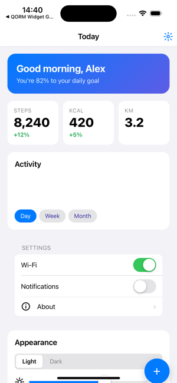
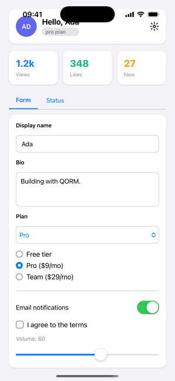

<!-- data-lang-nav --><p align="right"><a href="README.md">English</a> · <b>中文</b></p>

# QORM

<p align="center"><b>查询 · 观察 · 渲染 · 修改&nbsp;&nbsp;Query · Observe · Render · Mutate</b></p>

**与你的 AI 助手一起构建 UI 应用——实时协作。** QORM(Queryable Object
Rendering Model,可查询对象渲染模型)是一个面向智能体的
声明式 UI 运行时:用小巧、与语言无关的 JSON 描述 UI,你的 AI(Claude、Cursor……)
就能在你与它协作同一个运行中的应用时,**搭建、编辑、运行并验证**它——你点击,它看得见;
它编辑,你眼看着变化发生。

<p align="center"></p>

<sub>上面这段 GIF 是 QORM 自己录的——AI 通过 MCP 驱动编辑,`qorm shot` 用 WebKit 逐帧截图,无浏览器自动化工具。见 <a href="scripts/record-demo.sh">scripts/record-demo.sh</a>。</sub>

<p align="center"><b><a href="https://qorm.com/demo/">在线演示</a>——计数器应用打包为离线 PWA(Go → WASM),完全在你的浏览器里运行。</b></p>


### 同一个 app,打包成 iOS

<p align="center">
  
  
  
  
  
  
</p>

<sub>真实 iOS 构建(`qorm package -p ios`),在 iOS 模拟器里截取。同一份 JSON app
还能跑在 web / 安卓 / 桌面 / 小程序上。</sub>

底层默认构建是纯 Go:它在浏览器中实时运行应用,渲染出静态 HTML 快照,用 ed25519
签名打包成可分发的 bundle,通过空中下发(OTA)带回滚地提供服务,经由 MCP 向智能体开放,
并将其打包为 web / iOS / Android / 桌面 / 小程序——可从任意机器交叉编译。

与 Kimi(Moonshot AI)、Claude(Anthropic) 和 Gemini(Google) 协作开发——这很贴切,毕竟人机协作正是 QORM 的全部前提。

## 与你的 AI 助手一起构建

QORM 面向智能体:让你的 AI 编码助手(Claude Code、Claude Desktop、Cursor、Windsurf……)
指向它,由它来**搭建、编辑、运行并验证** QORM 应用——然后与你实时协作一个运行中的应用。
你点击,它看得见(`qorm_activity`);它编辑,你会看到一个 **"AI edited"** 提示。一次性配置好:

```sh
go install github.com/qorm/qorm/cmd/qorm@latest
claude mcp add qorm -- qorm mcp .      # or add integrations/mcp.json to your agent
```

然后只管开口——*"搭一个习惯追踪器"*、*"修一下这个溢出"*、*"打包成 web 应用"*。
完整指南:**[与你的 AI 一起构建](docs/zh/build-with-ai.md)** ·
[人机协作](docs/zh/collaboration.md)。

## 平台支持

<!-- support-summary:start -->
| 运行目标 | 可安装包 | UI 渲染 | 状态/动作 | 智能体/MCP |
|---|---|---|---|---|
| Web | ok | ok | ok | ok |
| iOS | ok | ok | ok | ok |
| Android | ok | ok | ok | ok |
| macOS | ok | ok | ok | ok |
| Linux | beta | ok | ok | ok |
| Windows | beta | ok | ok | ok |
| 小程序 | ok | beta | — | — |
<!-- support-summary:end -->

`ok` 已支持且已测试 · `beta` 基础/部分能力 · `—` 不适用。完整的特性清单
(分发、渲染、运行时、智能体——每一项按目标平台列出)见
[平台支持矩阵](docs/platforms/support-matrix.md);各平台的硬件接口见
[capabilities.md](docs/platforms/capabilities.md)。两者都由代码生成,并由测试保持同步。

## 运行

```bash
go run ./cmd/qorm run examples/counter      # opens the app in your browser
go run ./cmd/qorm render examples/todo -o todo.html   # static snapshot
```

在 counter 中按 `+` / `-`,或在 todo 应用中添加/切换任务——按钮点击会 POST 到
`/event`,服务器更新状态、重新运行 action,并换入重新渲染后的 UI。

## 签名 bundle(验证 bundle,而非信任服务器)

将应用编译成单个内容寻址的产物,并用 ed25519 签名。运行时会先验证完整性(防篡改检测),
在配有可信公钥时还会验证真实性——在运行任何一行之前。这是安全空中下发 UI 的信任基元。

```bash
qorm keygen                                        # -> qorm_key, qorm_key.pub
qorm build examples/counter -o counter.qorm.bundle --key qorm_key
qorm verify counter.qorm.bundle --trust qorm_key.pub
qorm run    counter.qorm.bundle --trust qorm_key.pub   # refuses tampered/unsigned bundles
```

被篡改的 bundle 无法通过哈希校验;由不可信密钥签名的 bundle 无法通过签名校验;
两者在运行时都会被拒绝。全部为纯 Go(`crypto/ed25519`),因此和其他一切一样可交叉编译。

## 交叉编译每个平台

```bash
./scripts/build-all.sh          # -> dist/qorm-{darwin,linux,windows}-{amd64,arm64}
```

每个目标都是一个约 7 MB 的单一静态二进制,无运行时依赖。在这个默认(纯 Go)构建中,
`qorm run --app` 会在一个无边框浏览器窗口中打开应用。

## 原生桌面窗口(可选开启)

若需要真正的原生窗口,使用 `-tags desktop` 构建。它通过 cgo 驱动平台原生
WebView(WKWebView / WebView2 / WebKitGTK)——因此是**按平台**构建,而非从一台机器交叉编译:

```bash
./scripts/build-desktop.sh                     # native binary for this OS
qorm-desktop-... run examples/counter --app    # opens a native window
```

两条路径刻意共存:默认 = 处处交叉编译(浏览器窗口);`-tags desktop` = 原生窗口
(按平台构建)。两者都在 web 引擎中渲染 **HTML/CSS**,因此都保留完整的智能体协作栈
(经 SSE + MCP 共享的实时会话)。QORM 架构(loader → runtime → render → server)
在两者中完全一致。

| build | render | draws widgets |
|---|---|---|
| default | HTML/CSS → browser | web engine |
| `-tags desktop` | HTML/CSS → native WebView | web engine |

## 经由 MCP 的智能体访问

通过模型上下文协议(stdio JSON-RPC)向智能体(Claude、Cursor……)开放应用:

```bash
qorm mcp examples/counter
```

智能体可以**设计、运行、测试并操作**应用——这正是真正人机协作的闭环:

| capability | tools |
|---|---|
| understand | `qorm_inspect`, `qorm_render_html`, `qorm_get_node`, `qorm_list_actions` |
| operate    | `qorm_dispatch` (run an action), `qorm_set_state` |
| test       | `qorm_assert` (stateEquals / htmlContains / nodeExists) |
| design     | `qorm_preview_patch` → `qorm_apply_patch` |
| reason     | `qorm_simulate_action` (side-effect-free) |

安全模型:`simulate` 和 `preview_patch` 从不触碰运行中的应用;`apply_patch`
必须携带由**相同**操作的前一次 `preview_patch` 返回的 `previewToken`——
因此一次已提交的设计改动始终与一次评审绑定。

### 共享实时会话(人 + AI,同一个应用)

`qorm run` 还会在 `/mcp` 上通过 HTTP 向智能体开放,并共享浏览器所渲染的*同一个*
运行时。AI 的编辑会**即时**出现在每个已连接的浏览器中——页面在 `/events`
订阅服务器推送事件(SSE,带 `/poll` 回退)——而人的点击对 AI 的下一次
`qorm_inspect` 可见。在同一个运行中的应用上实现真正的实时人机协作。


<p align="center"></p>

<sub>**活动面板**——桌面版在 app 旁边单开的一个窗口——把每一次人类点击(绿)和
AI 的 MCP 调用(蓝)都按颜色实时显示在*同一个*运行中的 app 上。这就是人类观察协作的那扇窗。</sub>

```bash
qorm run examples/counter          # browser UI + agent endpoint at /mcp
# agent: POST http://127.0.0.1:PORT/mcp  (JSON-RPC 2.0)
```

## 架构

```
app JSON (manifest + scenes + actions)
  → loader   parse into model.App (Node tree / Action / GlobalState)
  → runtime  state store + {{expr}} evaluation + action dispatch
  → render   Node → HTML + CSS flexbox (browser does layout)
  → server   HTTP + /event live update loop
```

| package | role |
|---|---|
| `internal/model`   | App / Node / Action data model |
| `internal/loader`  | load a dir (skips `type:test`), parse manifest/scene/action |
| `internal/expr`    | expression evaluator (`count + 1`, `state.x`, ternary, ...) |
| `internal/runtime` | state, binding interpolation, action steps (`state.set/append/appendObject/toggle`) |
| `internal/render`  | full widget set → HTML/CSS, incl. `list` repeat with `{{item.*}}` scope |
| `internal/server`  | live HTTP server + event dispatch |
| `internal/bundle`  | compile + sha256 content hash + ed25519 sign/verify |
| `internal/keys`    | ed25519 keypair generation and storage |
| `internal/ota`     | fetch (http/file) + verify-before-activate, rollback by inaction |
| `internal/mcp`     | MCP stdio JSON-RPC server (agent tools) |
| `cmd/qorm`         | `run` / `render` / `build` / `keygen` / `verify` / `mcp` CLI |

## 组件覆盖

一流的组件词汇表,全部映射到语义化 HTML/CSS:

- **布局**:row、column、stack/absolute、`scroll`、`grid`(N 列)、`card`、
  `spacer`、`divider`、wrap。
- **文本**:text、`link`、`icon`、`badge`——支持 fontFamily、lineHeight、
  letterSpacing、textDecoration、`lineClamp`/`ellipsis`、transform。
- **输入**:input(双向状态绑定)、`textarea`、`select`、checkbox、
  switch、`radio`、slider——支持 `onChange` 事件。
- **媒体/反馈**:image、`avatar`(图片或首字母)、`progress`、
  `spinner`、`video`。
- **结构**:`tabs`(客户端切换)、`list`(带 `{{item.*}}` 作用域的数据绑定重复)。

外加每个节点上的横切特性:条件渲染
(`"if": "{{state.x}}"`)、无障碍(`role`、`ariaLabel`、`title`),以及丰富的
样式(shadow、gradient、position + top/left/right/bottom、aspectRatio、
min/max width/height、opacity、transition)。参见 `examples/gallery`。

## 空中下发更新

一个运行中的应用(从 bundle 启动)接受热更新:`POST /update
{"source": "<url-or-path>"}` 会抓取、验证(哈希 + 对可信密钥的签名)并热替换应用;
`POST /rollback` 回退。被拒绝的更新不会改动运行中的应用——坏更新永远无法让它崩溃。

## 文档

QORM 是双消费者的——同一批产物同时服务于人类开发者和 AI 智能体。

- **人类**从 [`docs/`](docs) 开始:[入门教程](docs/zh/tutorials/getting-started.md)、
  [组件目录](api/zh/widgets.md)和[能力清单](docs/platforms/capabilities.md)
  (两者均由代码自动生成)、平台指南,以及[用户中间层](docs/zh/platforms/native-middlelayer.md)——
  在一个 `native/desktop.go` 中添加你自己的原生操作,它会同时编译进桌面二进制*和*
  移动/web WASM。
- **AI 智能体**从 [`llms.txt`](llms.txt)(或 [`AGENTS.md`](AGENTS.md))开始:
  一份经过整理、机器可读的上述一切的地图。用 [`integrations/`](integrations)
  把 QORM 添加到你的智能体,经由 [MCP](docs/agent/mcp-tools.md) 驱动一个运行中的应用,
  并用 `qorm measure` / `qorm check` 针对真实渲染几何自我验证你的编辑
  (见[验证](docs/zh/verification.md))。

## 许可证

源码采用 [MIT](LICENSE)——可自由使用、修改和分发。有一条品牌条款适用
([ops/TERMS.md](ops/TERMS.md)):应用默认带有 QORM 标志;个人 / 教育 / 开源用途可自由更换图标,
而**商业白标**(自定义图标,或移除 "Made with QORM" 元数据说明)则需要一个
Patreon 会员——**Indie 每月 $1**(个人)或 **Studio 每月 $7**(公司)。**Supporter** 档
(每月 $3)以优先特性请求支持本项目;个人/教育/开源用途属于免费的 **Community** 档。
`qorm` CLI 会在你打包商业特性时请你确认(荣誉制)。支持者会在 QORM Patreon 页面上获得致谢。

**创业团队或不方便订阅?** 如果你是早期创业团队,或订阅对你不方便(支付渠道、
公司规定,任何原因都行),给 **github@qorm.com** 发一封邮件,简单说明一下情况,
我们会直接回复授权,免费一年(到期再发一封邮件续期即可)。

<details>
<summary>邮件示例</summary>

> **收件人:** github@qorm.com
> **主题:** 白标授权申请——Acme 习惯打卡
>
> QORM 团队你们好,
>
> 我们是 Acme,一个 3 人创业团队,正在做一款习惯打卡应用。我们想以白标方式发布
> (自定义图标、去掉 "Made with QORM" 说明),但目前订阅 Patreon 对我们不太现实——
> 产品还没有收入,而且我们所在地区支付也不方便。
>
> 能否给我们授权?我们很乐意在产品的"关于"页面为 QORM 署名致谢。
>
> 谢谢!
> 张三 · 创始人 · acme.example

</details>

## 路线图

HTTPS OTA(`qorm run --tls`)、密钥吊销列表(`--revoked`)以及智能体 `apply_patch`
工具均已落地。其余方向——一个托管的文档门户、一个沙箱化的 Playground,以及生态注册表——
在 `docs/planning/` 中追踪。

## 致谢

可选的原生桌面窗口内置(vendor)了 [webview](https://github.com/webview/webview)
C/C++ 库及其 [Go 绑定](https://github.com/webview/webview_go)(MIT,(c) Serge
Zaitsev)——感谢。可选原生窗口的思路受 [Wails](https://github.com/wailsapp/wails) 启发。
