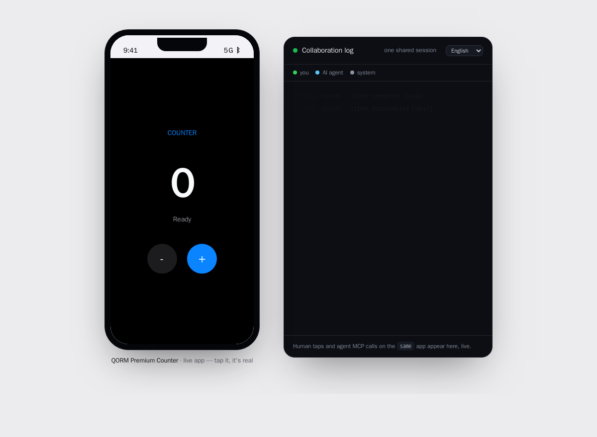
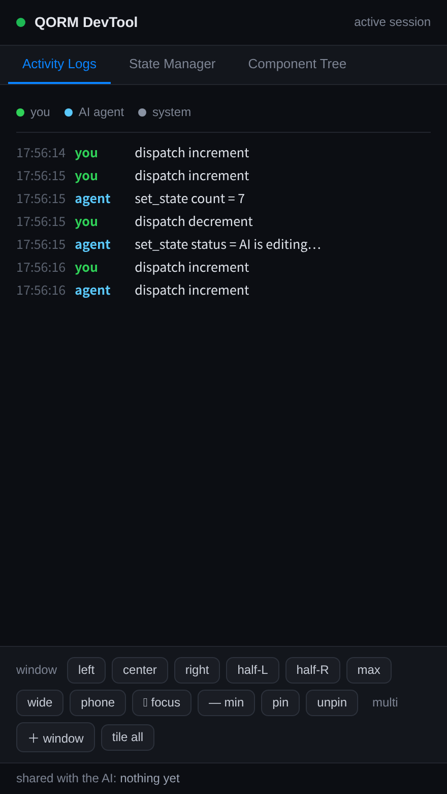

# Human-AI collaboration on a live app

QORM's premise: a person and an AI agent work on the **same running app at the
same time**, and each sees the other. `qorm run` serves one live runtime over
the human UI (native canvas on macOS by default, or browser/WebView), HTTP MCP
for the agent, and the DevTool/activity stream. Browser/WebView viewers stay in
sync over Server-Sent Events (SSE).


*One running app, two panes: the live UI on the left and the shared session log on the right.*

## Start a shared session

```sh
qorm run examples/counter          # native/browser UI + agent endpoint at /mcp
```

- **Human** — use the window QORM opens, or open the printed URL. Native canvas
  dispatches directly; browser/WebView clicks POST `/event`.
- **AI** — POST JSON-RPC to `http://127.0.0.1:PORT/mcp`. That HTTP endpoint
  shares the *same* runtime as the human UI. `qorm mcp examples/counter` is a
  separate stdio runtime and is useful for standalone tooling, not this live
  shared-session loop.

## The loop — each sees the other

- **The human sees the AI.** When the agent edits the app (`qorm_apply_patch`,
  `qorm_dispatch`, `qorm_set_state`), the change appears in every connected browser
  **instantly** over SSE. An **"AI edited · &lt;what&gt;"** toast names it, and the
  elements the agent actually touched briefly **pulse a blue outline** — so you see
  not just *that* it edited but *where*.
- **The AI sees the human.** `qorm_activity` returns the shared session's live
  presence: the `events` log (who did what, in order), `humanFocus` (the element the
  human is on right now), `humanTyping` (the text they last entered), and
  `humanFilled` (which password fields they completed — by label only; a password
  value is **never** captured). So the agent collaborates in context — "the human is
  filling the email field" — instead of guessing from state.
  Native canvas pointer/keyboard actions enter the same human `events` stream
  and DevTool as browser/WebView actions. Canvas also reports privacy-safe
  focus, typing, and hidden-field labels through the same presence model.
- **The human sees what's shared.** The activity panel (a separate window the
  desktop app opens, or `/logwindow`) shows a *shared with the AI* line — the human's
  own focus and typed text, password fields marked *value hidden* — so it is
  transparent exactly what the agent can perceive.


*The shared session, made transparent: what the human sees in the DevTool is exactly what the agent can perceive.*

## Safe edits — review-bound

The agent's design changes are gated so a live app can't be changed unreviewed:

- `qorm_simulate_action`, `qorm_preview_patch` and `qorm_diff` run against a copy
  and never touch the live app.
- `qorm_apply_patch` commits only if it carries the `previewToken` from a matching
  `qorm_preview_patch` of the same ops — every committed change was previewed.
- `qorm_undo` reverts the last apply.

## Self-verify

The agent proves its edits against the rendered reality, not assumptions:
`qorm_measure` / `qorm_check_layout` (or the CLI `qorm measure` / `qorm check`)
render the app and report real geometry. See [verifying an app](verification.md).

## Tools at a glance

| role | tools |
|---|---|
| understand | `qorm_inspect`, `qorm_query`, `qorm_get_node`, `qorm_render_html`, `qorm_activity` |
| operate | `qorm_dispatch`, `qorm_set_state` |
| design (safe → commit) | `qorm_preview_patch` / `qorm_diff` → `qorm_apply_patch`, `qorm_undo` |
| verify | `qorm_measure`, `qorm_check_layout` |

Full reference: [MCP tools](agent/mcp-tools.md). To add QORM to your agent, see
[`integrations/`](https://github.com/qorm/qorm/tree/main/integrations).
