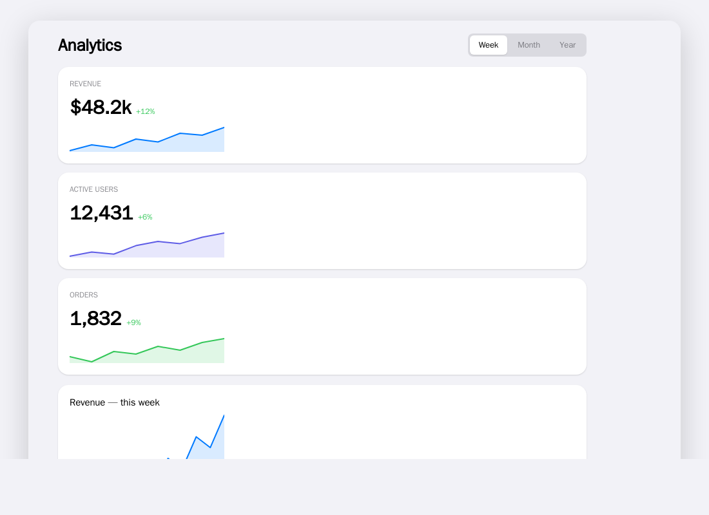

# QORM Web Platform

The web platform connects to QORM through the WASM Runtime or the TypeScript Adapter.

## Package it

```sh
qorm package examples/dashboard -p web -o dashboard-web   # an installable, offline PWA
```

Serve the output folder and "Add to Home Screen". Any example packages to web.
See the [support matrix](support-matrix.md).

Raiden/Mario-class games need the canvas host (`qorm_canvas` / games page);
default `qorm package -p web` is HTML morph, not full canvas game fidelity.


*`qorm package -p web` produces an installable PWA — here the dashboard example opened in a browser.*

## `http.*` steps run in the background here

The packaged app carries the QORM runtime as WASM, and js/wasm is
single-threaded: the goroutine running your action is the same one servicing the
browser's event loop. A blocking request there does not slow the app down, it
deadlocks it. So this host — like the standalone WASM runtime and the live
playground, which are the same binary — runs **every** `http.*` step on a
background worker, whether or not its JSON opted in with `"async": true`.

That is a user-visible semantic, not an implementation detail:

> The steps that follow an `http.*` step run **while the request is still open**.
> Any step that depends on the reply belongs in `onSuccess` / `onError`.

An action written that way behaves identically under `qorm run` and in the
package. An action that reads a response from a sibling step works on the dev
server (where requests block unless you opt in) and silently reads a stale
value once packaged — writing `"async": true` explicitly reproduces the packaged
behaviour while you develop. See
[First action](../tutorials/first-action.md) for the full pattern.

The push channel that carries the answer back is the same one intermediate
frames use: the page installs `window.qormApplyFrame`, so a `render` step's
loading frame reaches the screen and the request's completion arrives later as
its own frame. Every path that swaps the runtime — an applied OTA update, a
rollback — re-installs it, and a reply that belongs to a runtime that has since
been replaced is dropped rather than written into its successor.

## Architecture

```text
qorm.bundle.json
  ↓
QORM WASM Runtime / Web Runtime
  ↓
Web Host Adapter
  ↓
Renderer
  ↓
Browser
```

## Host Adapter

On the web, low-level capabilities are constrained by the browser. They should be wrapped through the Web Host Adapter:

```text
network.request
storage.read/write
clipboard.read/write
navigation.go
file.open
notification.show
```

## Web security boundaries

- The browser sandbox is the outermost capability boundary.
- The QORM Web Runtime cannot exceed the capabilities granted by the browser.
- The Web Host Adapter is QORM's permission and policy enforcement point inside the browser.
- A native browser permission prompt is not equivalent to a QORM approval; if both are required, both must pass.

## Network requests

The web platform uses an HttpClient abstraction:

```text
default fetch
pluggable custom HttpClient adapter
```

### Custom HttpClient boundaries

- The custom client is responsible only for the transport implementation, not for permission decisions.
- Domain, method, header, credentials, and approval checks must be performed on the Host Adapter side.
- The custom client cannot bypass QORM's `network.request` capability constraints.
- CORS, cookie, and same-origin restrictions remain under browser control.

Action example:

```json
{
  "type": "host.call",
  "capability": "network.request",
  "input": {
    "method": "GET",
    "url": "/api/tasks",
    "responseType": "json"
  },
  "output": {
    "path": "tasksResponse"
  }
}
```

## Rendering routes

Available routes:

```text
DOM renderer
Canvas renderer
WebGPU renderer
WASM + GPU renderer
```

V1 can start with the route that is easiest to validate, then strengthen high-performance rendering later.

## Limitations

The web platform cannot assume:

```text
Arbitrary filesystem access
System-level clipboard access
Long-running background execution
Arbitrary cross-origin networking
Local Native Capability
```

## Audit visibility

Web audit records are affected by browser privacy and storage constraints. Even so, permission decisions, approval ids, and capability results should still be recorded to the available local or host logs as much as possible.