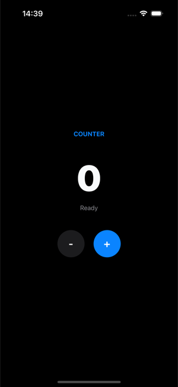

# First Action

An action is QORM's declarative behavior. An action is a sequence of `steps`, placed in `actions/<id>.json`, and triggered by name from an `onPress` in the UI.

## Defining an action

`actions/increment.json`:

```json
{
  "type": "action",
  "id": "increment",
  "steps": [
    { "type": "state.set", "path": "count", "value": "{{ state.count + 1 }}" }
  ]
}
```

## Triggering from the UI

A button's `onPress` is the action name (a string); to pass arguments, use an object `{ "name": …, "args": … }`.

```json
{ "type": "button", "id": "inc", "text": "+1", "onPress": "increment" }

{ "type": "button", "id": "toggleTask", "text": "Done",
  "onPress": { "name": "toggle", "args": { "id": "{{ item.id }}" } } }
```


*The `+` button fires the `increment` action above; both the number and the status label read state the action writes.*

## Common step types

```json
{ "type": "state.set",       "path": "name",  "value": "Ada" }
{ "type": "state.increment", "path": "count", "value": 1 }
{ "type": "state.toggle",    "path": "dark" }
{ "type": "state.append",    "path": "items", "value": { "id": 3, "text": "new" } }
{ "type": "state.toggle",    "path": "items", "matchKey": "id", "match": "{{ id }}", "field": "done" }
```

Inside `{{ … }}` is a full expression (it can read `state.*` / action arguments and do arithmetic); list-oriented steps use `matchKey` + `match` to locate a specific item. See [Expressions](../expressions.md) for the whole language.

## Branching with `if`

An `if` step runs one of two nested step lists depending on a condition:

```json
{
  "type": "if",
  "condition": "{{ len(trim(state.name)) > 0 }}",
  "then": [
    { "type": "state.set", "path": "message", "value": "Hello {{ state.name }}" },
    { "type": "state.set", "path": "formError", "value": "" }
  ],
  "else": [
    { "type": "state.set", "path": "formError", "value": "Name is required" }
  ]
}
```

Both branches are optional and `if` steps nest (up to 32 deep). The condition
uses the same truthiness rules as a node's `if` prop: `null`, `false`, `0`, `""`
and empty collections are falsy. Remember the `{{ … }}` — a bare string like
`"state.count > 0"` is a non-empty constant, so it is always truthy; the loader
warns about exactly that mistake.

## Calling another action

An `invoke` step calls another action by name, so shared behaviour lives in one
file instead of being copy-pasted:

```json
{ "type": "invoke", "name": "resetForm", "args": { "keepEmail": "{{ true }}" } }
```

`args` are evaluated in the **caller's** context and merged into the callee's
scope, exactly like the args on a button's `onPress`. Call depth is capped at
16, so a recursive or mutually-recursive chain terminates instead of hanging;
the loader reports a target action that does not exist.

## Calling a backend

`http.get` writes the response to a state path, and writes failures to the `error` path:

```json
{ "type": "http.get", "url": "https://catfact.ninja/fact", "result": "fact", "error": "err" }
```

### Success and failure branches

Any `http.*` step can carry `onSuccess` / `onError` step lists that run after
the request returns. Inside `onSuccess` the decoded body is bound to
`{{ response }}`; inside `onError` the failure message is bound to `{{ error }}`:

```json
{
  "type": "http.get",
  "url": "https://api.example.com/items",
  "result": "items",
  "error": "loadError",
  "onSuccess": [
    { "type": "state.set", "path": "total",  "value": "{{ count(response) }}" },
    { "type": "state.set", "path": "status", "value": "loaded" }
  ],
  "onError": [
    { "type": "state.set", "path": "status", "value": "Could not load: {{ error }}" }
  ]
}
```

The classic writes still happen first and are unchanged: on success `result` is
written and any stale `error` path is cleared, on failure the `error` path is
written and `result` is left alone. The branches run after that, so
`{{ state.items }}` is already populated inside `onSuccess`.

Failures include transport errors and any non-2xx status (whose message is the
status line, e.g. `500 Internal Server Error`). Requests time out after 20
seconds; there is no per-step timeout field.

## Timers

A `timer` is an invisible node you place in the scene tree — it renders nothing
and schedules an action instead. Use `every` for a repeating tick or `after`
for a one-shot, both in milliseconds:

```json
{ "type": "timer", "id": "poll",      "every": 5000, "onTick": "refresh" }
{ "type": "timer", "id": "hint_once", "after": 2000, "onTick": "showHint" }
```

`onTick` takes an action name or the `{ "name": …, "args": … }` form, and
dispatches through exactly the same path as a button press. Because a timer is
a node, its **lifetime is its presence in the tree** — put an `if` on it and it
stops itself:

```json
{ "type": "timer", "id": "countdown", "every": 1000,
  "if": "{{ state.running }}", "onTick": "tick" }
```

The scheduler reconciles timers after every re-render, so the same `id` is
never double-scheduled, a timer that disappears is cancelled, and a changed
interval reschedules. `every` is floored at 250 ms, and repeating ticks pause
while the browser tab is hidden. A timer needs an `id` — that is the key the
scheduler reconciles on.

## Scene lifecycle: `onEnter`

A scene can name an action to run whenever it is entered — the usual "load this
screen's data" hook. It sits next to `root` in the scene file:

```json
{
  "type": "scene",
  "id": "main",
  "onEnter": "loadData",
  "root": { "type": "column", "id": "root", "children": [] }
}
```

The object form `{ "name": "load", "args": { … } }` works too, with args
evaluated in the scene's context. `onEnter` fires on the entry scene's first
load, on a deep link straight into the scene, on a `navigate` step, and on
navigating **back** into it. It is deliberately not replayed by a page refresh,
an SSE reconnect, or a dev hot reload — so a load action does not run twice for
one visit. Make it idempotent anyway by guarding it with an `if`.

There is no `onExit` counterpart today.

`examples/lifecycle` wires all of this together — an `onEnter` load, a polling
timer, a one-shot `after` hint, an `if`-guarded countdown that stops itself,
and a form submit with `if`/`else` branches plus an `invoke` reset:

```sh
qorm run examples/lifecycle
```

## Standard action patterns

These are the reusable shapes built entirely from the step types above. Each is a real, load-clean recipe — copy the JSON and rename the paths. Working examples live in `examples/form` (form validation) and `examples/tasks` (optimistic update + error handling).

### Loading state

A dispatch paints one frame by default, **after** every step has finished — by
which time `loading` is already back to `false`, so the flag would never be
seen. The `render` step is what makes it visible: it publishes the state written
so far as a frame, right where it appears, before the slow step blocks.

```json
[
  { "type": "state.set", "path": "loading", "value": "{{ true }}" },
  { "type": "render" },
  { "type": "http.get", "url": "https://api.example.com/items", "result": "items", "error": "error" },
  { "type": "state.set", "path": "loading", "value": "{{ false }}" }
]
```

That frame is an ordinary render, so anything conditioned on the flag appears:

```json
{ "type": "row", "if": "{{ state.loading }}", "children": [
  { "type": "spinner", "id": "spin", "size": 16 },
  { "type": "text", "id": "lbl", "text": "Loading…" }
] }
```

`render` only ever adds frames — leave it out and the action lands in a single
frame exactly as before, and where the app is running determines whether the
extra frames are drawn at all. It is a no-op on a host that does not paint
mid-action, so the same JSON is safe everywhere. `examples/netdemo` and
`examples/tasks` both ship this shape.

### Background request (`async`)

`render` makes the spinner visible, but the request still runs to completion
before the dispatch ends — so nothing else in the session moves until the
backend answers. Add `"async": true` and the request is handed to a background
worker instead: the dispatch returns immediately (its frame already shows the
loading state) and the result branch runs when the reply arrives.

```json
[
  { "type": "state.set", "path": "loading", "value": "{{ true }}" },
  { "type": "http.get", "url": "https://api.example.com/items", "async": true,
    "result": "items", "error": "error",
    "onSuccess": [ { "type": "state.set", "path": "loading", "value": "{{ false }}" } ],
    "onError":   [ { "type": "state.set", "path": "loading", "value": "{{ false }}" } ] }
]
```

Two rules follow from the request outliving the dispatch:

- **Read the result in `onSuccess` / `onError`, never in a sibling step.** The
  steps after an async request run straight away, while it is still open, so a
  sibling would read the value from *before* the call.
- **Clear the loading flag in both branches.** A flag cleared only in
  `onSuccess` is stuck on forever the first time the backend fails.

Inside a branch, `{{ state.x }}` reads the state as it is *now* (the user may
have kept typing), while the action's own arguments still hold the values the
click carried. `async` defaults to `false`, and falls back to `false` on a host
with no background worker, so a step that reads its response from a sibling
keeps working unchanged. `examples/netdemo` ships both shapes side by side.

### Error handling

`http.*` writes any failure message to the `error` path (and clears it on success). Bind `{{ state.error }}` in the UI and show it with an `if`:

```json
{ "type": "http.post", "url": "https://api.example.com/save", "body": "{{ state.draft }}", "error": "error" }
```

```json
{ "type": "text", "if": "{{ len(state.error) > 0 }}", "text": "Could not save: {{ state.error }}" }
```

When the two outcomes need different follow-up work rather than a different
message, use the `onSuccess` / `onError` branches shown above instead of
inspecting the error path afterwards.

### Optimistic update (with rollback)

Mutate state immediately, call the backend, then revert **only if** the call set the error path. The rollback re-applies the same toggle, but its `match` collapses to an empty string (matching nothing) on success — so success is a no-op and failure reverts:

```json
[
  { "type": "state.toggle", "path": "tasks", "matchKey": "id", "match": "{{ id }}", "field": "done" },
  { "type": "http.put", "url": "https://api.example.com/tasks/{{ id }}", "error": "error" },
  { "type": "state.toggle", "path": "tasks", "matchKey": "id", "match": "{{ len(state.error) > 0 ? id : \"\" }}", "field": "done" }
]
```

### Form validation

Write each field's error with one conditional `state.set` (a ternary picks the message or an empty string), then bind `{{ state.fieldErrors.email }}`. A later step can read the errors it just wrote to derive an overall status:

```json
[
  { "type": "state.set", "path": "fieldErrors.email",
    "value": "{{ len(trim(state.email)) == 0 ? \"Email is required\" : (matches(state.email, \"^[^@\\\\s]+@[^@\\\\s]+\\\\.[^@\\\\s]+$\") ? \"\" : \"Enter a valid email address\") }}" },
  { "type": "state.set", "path": "status",
    "value": "{{ len(state.fieldErrors.email) == 0 ? \"OK\" : \"Please fix the highlighted fields\" }}" }
]
```

```json
{ "type": "text", "if": "{{ len(state.fieldErrors.email) > 0 }}", "text": "{{ state.fieldErrors.email }}" }
```

An `if` step reads better than a ternary once a field has more than two
outcomes, and it can write several paths per branch.

Input widgets also carry the browser's native constraint attributes —
`required`, `pattern`, `maxLength`, plus `inputMode` for the on-screen
keyboard. Those give the user immediate native feedback, but they do **not**
block an action: a button's `onPress` dispatches from its own click handler.
Gate submission yourself by binding the submit button's `disabled` to your
validity expression.

### Pagination

For **server-side** paging, keep a `page` counter in state and advance it; the offset is computed in the request URL binding:

```json
[
  { "type": "state.increment", "path": "page", "value": 1 },
  { "type": "http.get", "url": "https://api.example.com/items?offset={{ state.page * 20 }}&limit=20", "result": "items", "error": "error" }
]
```

For **client-side** paging over an array you already hold, no action is needed:
give the `list` (or `gridview`) a `pageSize` and bind `page` to the counter —
see [First Scene](first-scene.md). `datatable` has no built-in paging, so it
still needs a `slice()` expression over the state array.

### Debounced search — *pattern via existing mechanism*

There is no `debounce` step. Debounce is a client-side concern: bind the input to `{{ state.q }}` via `onChange` and let the UI throttle how often it invokes the search action. The action itself is just an `http.get`:

```json
{ "type": "http.get", "url": "https://api.example.com/search?q={{ state.q }}", "result": "results", "error": "error" }
```

Request cancellation (cancel token) is likewise not modeled by a step today — treat it as **planned**; the last response written to `result` wins.

- Actions are entirely declarative data — no arbitrary code. When you need custom native logic, see the [User middle layer](../platforms/native-middlelayer.md).
- When external side effects / system capabilities are involved, follow the [Permission model](../security/permission-model.md).
