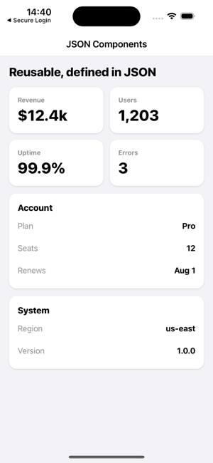

# First Component

Components let you reuse UI structure. A component is a template declared **in `components` within `qorm.json`**; inside the template, `{{ prop.x }}` reads the properties passed in by the instance. Instantiate it with a node whose `type` equals the component name.

## Declaring a component (qorm.json)

```json
{
  "type": "app",
  "id": "my_app",
  "entry": "main",
  "components": {
    "user_card": {
      "type": "card",
      "style": { "padding": 16, "gap": 4 },
      "children": [
        { "type": "text", "text": "{{ prop.name }}",  "style": { "fontWeight": 700 } },
        { "type": "text", "text": "{{ prop.email }}", "style": { "color": "#8e8e93" } }
      ]
    }
  }
}
```

## Using a component (scene)

The node's `type` is the component name; properties are written directly on the node as ordinary fields.

```json
{ "type": "user_card", "id": "u1", "name": "Ada", "email": "ada@example.com" }
```


*Components declared once in JSON — metric tiles and key/value panels — reused across a screen (`examples/uikit`).*

## Slot (filling in child content)

Place a `{ "type": "slot" }` placeholder in the template; the instance's `children` are filled into it.

```json
"components": {
  "panel": {
    "type": "card",
    "style": { "padding": 16, "gap": 6 },
    "children": [
      { "type": "text", "text": "{{ prop.title }}", "style": { "fontWeight": 800 } },
      { "type": "slot" }
    ]
  }
}
```

The instance passes `children` to fill the slot:

```json
{ "type": "panel", "id": "acct", "title": "Account", "children": [
  { "type": "text", "text": "Plan: Pro" },
  { "type": "text", "text": "Seats: 12" }
] }
```

## Passing live data as props

A prop value may be a binding. It is evaluated once in the **instance's** scope
— so `{{ state.x }}`, `{{ item.x }}` and route params all resolve — and the
result keeps its type: a boolean stays a boolean, a number stays a number, a
list stays a list.

```json
{ "type": "stat_card", "id": "cpu",
  "label": "CPU",
  "value":  "{{ state.metrics.cpu }}",
  "warn":   "{{ state.metrics.cpu > 80 }}",
  "series": "{{ state.metrics.history }}" }
```

Inside the template those props work as real values, not as text:

```json
{
  "type": "column",
  "children": [
    { "type": "text", "text": "{{ prop.label }}: {{ prop.value * 100 }}%" },
    { "type": "text", "if": "{{ prop.warn }}", "text": "High" },
    { "type": "list", "data": "{{ prop.series }}",
      "renderItem": { "type": "text", "text": "{{ item }}" } }
  ]
}
```

Because a component instance can sit inside a `renderItem`, this is what makes
a component usable as a list-row template — pass `{{ item.… }}` straight in.

If you prefer to keep props apart from the node's own fields, write them under
a nested `props` object; those keys win over top-level keys of the same name.

```json
{ "type": "stat_card", "id": "cpu", "props": { "label": "CPU", "value": "{{ state.cpu }}" } }
```

## Callback props

An invoke's `name` may itself be a binding, so a component can accept the
action to run as a prop. The name is resolved when the handler is registered,
so the button dispatches the real action:

```json
"components": {
  "confirm_bar": {
    "type": "row",
    "children": [
      { "type": "button", "id": "ok",     "text": "{{ prop.okLabel }}", "onPress": { "name": "{{ prop.onConfirm }}" } },
      { "type": "button", "id": "cancel", "text": "Cancel",             "onPress": { "name": "{{ prop.onCancel }}" } }
    ]
  }
}
```

```json
{ "type": "confirm_bar", "id": "del", "okLabel": "Delete",
  "onConfirm": "deleteItem", "onCancel": "closeDialog" }
```

## Named slots

A template may declare several slots by giving each a `name`, and the instance
attributes each child to one with a `slot` field. Children with no `slot` fill
the unnamed slot.

```json
"components": {
  "frame": {
    "type": "column",
    "children": [
      { "type": "slot", "name": "header" },
      { "type": "slot" },
      { "type": "slot", "name": "footer", "children": [
        { "type": "text", "text": "No actions" }
      ] }
    ]
  }
}
```

```json
{ "type": "frame", "id": "f1", "children": [
  { "type": "text",   "text": "Account",  "slot": "header" },
  { "type": "text",   "text": "Body copy" },
  { "type": "button", "text": "Save", "onPress": "save", "slot": "footer" }
] }
```

A slot's own `children` are its **fallback** — they render only when nothing
fills that slot, so the `frame` above shows "No actions" when the instance
supplies no footer child. A single unnamed slot still behaves exactly as
before, so existing components keep working.

- `{{ prop.* }}` is only visible inside the component template; a field of the same name on the instance is the value passed in.
- Components can nest components (up to 32 deep); ids inside a template are suffixed per instance, so two instances never collide.
- Components have no local state or lifecycle of their own — they read the global store through the props you pass them.
- For a complete runnable example, see [`examples/uikit`](https://github.com/qorm/qorm/tree/main/examples/uikit) (metric / kv / panel).
