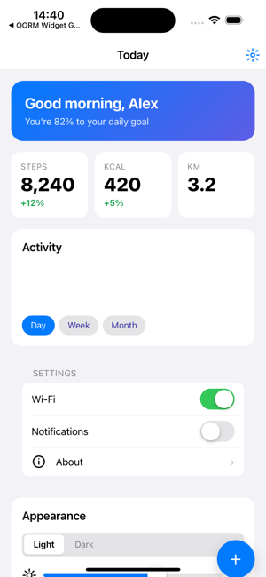

# First Platform Pack

> **Design intent — not implemented.** Platform Packs are the planned packaging
> format; the runtime does not load them yet and the CLI has no `--target`
> flag. For what packaging does today, see [Mobile](../platforms/mobile.md),
> [Desktop](../platforms/desktop.md) and [Web](../platforms/web.md).

A Platform Pack describes how QORM runs on a given platform.


*A QORM app running on iOS. Today this ships via `qorm package -p ios`; the Platform Pack is the planned way to describe such a target once.*

## Directory

```text
platform-packs/desktop/
├─ manifest.json
├─ capabilities.json
├─ renderer.json
├─ host-adapter.json
├─ event-adapter.json
└─ skill.md
```

## manifest.json

```json
{
  "qorm": "0.1",
  "type": "platform-pack",
  "id": "desktop",
  "version": "0.1.0"
}
```

## capabilities.json

```json
{
  "network.request": {
    "supported": true,
    "permission": "network.request"
  },
  "clipboard.write": {
    "supported": true,
    "permission": "clipboard.write"
  },
  "filesystem.saveFile": {
    "supported": true,
    "permission": "filesystem.write",
    "requiresApproval": true
  }
}
```

Notes:
- The boolean `true` should only be used as shorthand for the object form.
- A production Platform Pack should prefer the object form, which makes it easy to add constraints such as `permission`, `domains`, and `requiresApproval`.

## Usage

```bash
qorm check qorm.json --target desktop
qorm build qorm.json --target desktop
```