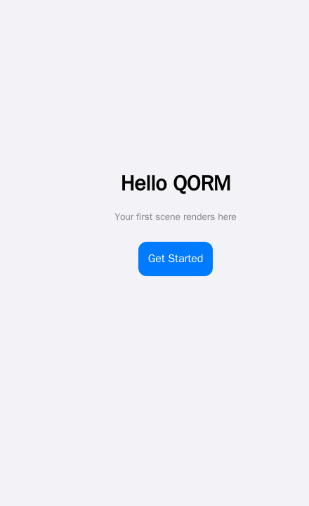

# First Scene

A scene is QORM's UI entry point. A scene has an `id` and a root node `root`; the node tree describes the UI. Text content goes in the `text` field, and `{{ state.x }}` interpolates global state.

## Minimal scene

```json
{
  "type": "scene",
  "id": "main",
  "root": { "type": "text", "id": "hello", "text": "Hello QORM" }
}
```

## Scene with layout

Container nodes (`column` / `row`) arrange their children using `style` (padding, spacing, background) and `layout` (size, alignment).

```json
{
  "type": "scene",
  "id": "main",
  "root": {
    "type": "column",
    "id": "root",
    "style":  { "padding": 24, "gap": 12 },
    "layout": { "width": "fill", "height": "fill", "align": "center" },
    "children": [
      { "type": "text",   "id": "title",  "text": "Title" },
      { "type": "button", "id": "submit", "text": "Submit", "onPress": "save" }
    ]
  }
}
```

- Use `text` (not `value`) for text; template interpolation like `"Welcome, {{ state.user }}"` also goes in `text`.
- Buttons use `onPress` to trigger actions (see [First Action](first-action.md)).
- For all available node types, see the [Widget catalog](/api/widgets.md).


*A scene renders to a screen — text nodes plus a button laid out by a column.*

## Lists and item scope

A `list` binds `data` to an array and repeats one `renderItem` template. Inside
that template the row is `item`, and its position is `index` (0-based) plus the
`first` / `last` flags.

```json
{
  "type": "list", "id": "rows", "data": "{{ state.items }}",
  "renderItem": {
    "type": "row", "children": [
      { "type": "text", "text": "{{ index + 1 }}." },
      { "type": "text", "text": "{{ item.title }}" }
    ]
  }
}
```

`index` / `first` / `last` are separate scope names, so a data field of the
same name is never shadowed: `{{ item.index }}` is your data, `{{ index }}` is
the loop position.

**Nested lists** rebind `item` on the inner loop. Give the outer list an `as`
alias to keep it reachable — `"as": "section"` binds `section` plus
`sectionIndex` / `sectionFirst` / `sectionLast`:

```json
{
  "type": "list", "data": "{{ state.sections }}", "as": "section",
  "renderItem": {
    "type": "column", "children": [
      { "type": "text", "text": "{{ section.title }}" },
      { "type": "list", "data": "{{ section.rows }}",
        "renderItem": { "type": "text", "text": "{{ section.title }} / {{ item }}" } }
    ]
  }
}
```

An invalid or reserved alias falls back to `item` with a load-time warning.
`gridview` takes the same `as` and the same scope names.

### List props worth knowing

| Prop | What it does |
|---|---|
| `separator` | draws a hairline between items — `true`, or `{ "height": 1, "inset": 16, "color": "…" }`. Never after the last item |
| `pageSize` + `page` | built-in pagination: only one window of `data` renders. `page` is 1-based and clamps into range, so an overshooting page shows the last one instead of a blank screen |
| `groupBy` + `sectionHeader` | splits **consecutive runs** of an equal key into sections with a header label. The renderer never reorders your data — sort it first |
| `sticky` + `stickyTop` | section headers stick while scrolling (`sticky` defaults to `true`); `stickyTop` parks them below an appbar |
| `onRefresh` | pull-to-refresh; dispatches the named action |
| `reorderable` + `onReorder` | press-hold drag to reorder |

```json
{
  "type": "list", "id": "contacts", "data": "{{ state.contacts }}",
  "groupBy": "letter", "sectionHeader": "{{ item.letter }}", "stickyTop": 44,
  "separator": true, "pageSize": 50, "page": "{{ state.page }}",
  "onRefresh": "reloadContacts",
  "renderItem": { "type": "listtile", "text": "{{ item.name }}" }
}
```

`index` stays global to the whole `data`, not to the current page, so numbering
keeps counting across pages. `groupBy` and `reorderable` are not combined
(section headers would misindex the drag), and `reorderable` takes precedence
over `onRefresh` (both would claim the same drag gesture).

Note that `virtualize` is a rendering hint (`content-visibility`), not real
windowing — the full item markup is still produced. Use `pageSize` when you
need the DOM itself to stay small.

## Tabs and panels

`tabs` takes its labels from a `tabs` array and its panels from `children`,
matched **by index**:

```json
{
  "type": "tabs", "id": "detail",
  "tabs": ["Overview", "Specs", "Reviews"],
  "active": "{{ state.tab }}",
  "scrollable": true, "swipe": true, "lazy": true,
  "indicator": "pill", "indicatorColor": "var(--accent)",
  "onChange": "tabChanged",
  "children": [
    { "type": "text", "id": "t1", "text": "Overview…" },
    { "type": "text", "id": "t2", "text": "Specs…" },
    { "type": "text", "id": "t3", "text": "Reviews…" }
  ]
}
```

| Prop | What it does |
|---|---|
| `active` | which tab is open, 0-based. Out of range clamps into range |
| `scrollable` | a horizontally scrolling tab bar; the active tab is scrolled into view automatically, however it changed |
| `swipe` | drag a panel sideways to the neighbouring tab. It activates that neighbour's own control, so it behaves the same in every mode; there is no wrap-around at the ends |
| `lazy` | render only the active panel |
| `indicator` · `indicatorColor` | `"pill"` or `"none"` (anything else is the default underline), tinted by `indicatorColor` |

Binding `active` to a **plain** `{{ state.x }}` path makes the tabs
*controlled*: the tab bar writes that state key itself, so switching tabs needs
no action file at all, and any other node bound to the same key follows along.
An expression like `{{ state.i + 1 }}` is not a plain path, so it renders a
read-only value instead.

`onChange` fires on every switch with two args merged in: `index` (the 0-based
position, as a string) and `tab` (the label). `lazy` needs the tabs to be
controlled or to carry an `onChange` — with neither, switching happens purely
in the browser and could only reveal panels that are already in the DOM, so
`lazy` is ignored. `indicatorColor` needs the node to have a plain identifier
`id`, and its value passes through a strict character allowlist, so anything
that could end a CSS declaration is dropped rather than emitted.

## Tables with widgets in cells

`table` and `datatable` render `data` against a `columns` list. A column is a
key string, or an object with `value` (the data key), `label` (the header
text), `width` and `sticky`.

By default a cell is the plain text of `obj[key]`. Give the table a **child
node carrying `column`** and that column renders your widget instead:

```json
{
  "type": "table", "id": "people",
  "data": "{{ state.people }}",
  "columns": [
    { "value": "name", "label": "Name", "width": 180, "sticky": true },
    { "value": "role", "label": "Role" }
  ],
  "stickyHeader": true, "stickyTop": 44,
  "scrollX": true, "maxHeight": 420, "minWidth": 720,
  "children": [
    { "type": "tag", "id": "role", "column": "role", "label": "{{ row.role }}" },
    { "type": "text", "id": "bio", "detail": true, "label": "Details", "text": "{{ row.bio }}" }
  ]
}
```

Inside a cell template the row is `row`, its position is `rowIndex` /
`rowFirst` / `rowLast`, and the cell itself is `cell` — `{{ cell.value }}`,
`{{ cell.column }}`, `{{ cell.index }}`. This is the same alias machinery a
list uses, so `"as": "person"` renames the set to `person` / `personIndex` /
`personFirst` / `personLast`, and an outer list's `item` stays reachable
alongside it.

A child carrying `detail: true` is not a column — it renders an expandable row
under every row, using the browser's own disclosure control. Its `label` (or
`text`) is the summary line, evaluated in the row scope.

The chrome keys are table-level, except `sticky`, which belongs to a column
object:

| Key | Effect |
|---|---|
| `stickyHeader` + `stickyTop` | the header row freezes while the body scrolls; `stickyTop` parks it below an appbar |
| `scrollX` | the table scrolls horizontally inside its own box |
| `maxHeight` | the body scrolls vertically inside that height |
| `minWidth` | keeps columns from crushing when `scrollX` is on |
| column `sticky` | freezes that leading column while the table scrolls sideways |

`datatable` takes all of the above on top of its own selection and sorting
props. Neither widget has built-in paging — see [First action](first-action.md).

## Accordion, tree, timeline, carousel

| Widget | Props worth knowing |
|---|---|
| `accordion` | `active` is the index of the open panel (bindable, clamped, defaults to the first). `single: true` makes the panels exclusive — opening one closes the rest; the default is independent toggles |
| `tree` | `collapsed: true` starts every branch closed. A data item's own `expanded` field still overrides that for its own node |
| `timeline` | each `items` entry may carry `time` (rendered above the title), `color` (the dot's colour) and `icon` (a name from the built-in SVG icon set, drawn inside the dot; an unknown name falls back to the plain dot) |
| `carousel` | `autoplay: 4000` advances the track on a clock — floored at 250 ms, paused while pointed at or while the browser tab is hidden, wrapping at the end. `indicators: true` draws a tappable dot row whose active dot follows the live scroll position |

## A collapsing large title

`largetitle` (aliases `sliverappbar`, `cupertinolargetitle`) draws the iOS
large-title header, and it **collapses by default**: the compact bar sticks to
the top while the big title scrolls up behind it and cross-fades into the
compact one.

```json
{ "type": "largetitle", "id": "hdr", "label": "Places", "subtitle": "8 saved nearby",
  "children": [ { "type": "icon", "id": "hdr-plus", "name": "plus", "size": 20 } ] }
```

- The title text is the node's `label` (or `text`); `subtitle` is optional.
- `children` are the trailing actions in the compact bar.
- `"collapsible": false` restores the old static header — one title, no sticky
  bar, byte-identical to what the widget rendered before collapsing existed.
- `background` sets the bar's fill (default `var(--bg)`).
- `appbar` is a separate widget and does not collapse.

The collapse itself is plain sticky positioning, so it works everywhere; the
cross-fade rides a CSS scroll-driven animation where the browser has one and a
small script drives the same declarations where it does not.

## Sheets

`sheet` (aliases `bottomsheet`, `draggablesheet`, `draggablescrollablesheet`,
`modalbottomsheet`) is a bottom panel the user drags between snap points.

```json
{ "type": "sheet", "id": "detail", "open": "{{ state.detail }}",
  "title": "Blue Bottle Coffee",
  "snapPoints": [0.3, 0.6, 0.92], "initialSnap": 1,
  "onSnap": { "name": "setSnap" },
  "children": [ { "type": "text", "id": "d1", "text": "Ferry Building · 240m" } ] }
```

| Prop | What it does |
|---|---|
| `open` | a falsy value renders **nothing at all** — there is no hidden markup. Omit it and the sheet is always present |
| `snapPoints` | the stop ladder as fractions of the containing box, sorted ascending. A value above 1 is read as a percentage (`90` is `0.9`). May itself be a binding to an array. Default `[0.25, 0.5, 0.9]` |
| `initialSnap` | index into that ladder; out of range falls back to the lowest stop |
| `onSnap` | one action, dispatched whenever the drag settles. It is registered once per stop and each carries the arg `snap` — the stop's index — so `{{ snap }}` tells the action where it landed |
| `onClose` | dispatched when the sheet is dismissed |
| `title` · `handle` · `backdrop` | the header line, the grab pill (`false` removes it) and the dimming scrim (`false` removes it) |

If `open` is bound to a plain state path and `dismissable` is not `false`, a
tap on the scrim closes the sheet through the built-in dismiss, so the common
case needs no action file. Flinging the sheet below 60% of its lowest stop
closes it the same way. There is no Escape-key dismiss.

Only the grab row claims the drag gesture — content scrolls normally — so a
sheet can hold a list, a swipeable row or a reorderable list without the two
gestures fighting.

`examples/places` puts all three of these together: a collapsing large title, a
frosted panel, and a sheet dragged between three stops.

```sh
qorm run examples/places
```

## Interactive styling

Pseudo-state style keys describe how a node reacts, with no JavaScript and no
extra nodes:

```json
{
  "type": "button", "id": "save", "text": "Save",
  "style": {
    "hoverBackground": "#0a84ff", "hoverColor": "#ffffff",
    "pressedScale": 0.97,
    "focusBorderColor": "var(--accent)",
    "disabled": "{{ state.saving }}", "disabledOpacity": 0.4
  }
}
```

The eight keys are `hoverBackground`, `hoverColor`, `hoverOpacity`,
`pressedScale`, `pressedOpacity`, `focusBorderColor`, `disabled` and
`disabledOpacity`. Hover styling only applies on devices that really hover, so
a tap can never strand a node in a hover state; `disabled` also emits
`aria-disabled`.

`width` and `height` accept a number of pixels, `"fill"`, or a string with a
unit — `"50%"`, `"30vw"`, `"40vh"`, `"120px"`. Layering and flex behaviour are
available as `zIndex`, `alignSelf` and `flexShrink`.

## Frosted glass

Two more style keys give any node the iOS translucent-panel look:

```json
{ "type": "column", "id": "glass",
  "style": {
    "position": "sticky", "top": 0, "padding": 14, "borderRadius": 16,
    "backdropBlur": 18,
    "backdropTint": "color-mix(in srgb,var(--surface) 62%,transparent)"
  } }
```

- `backdropBlur` is a **number** of pixels, capped at 120. It may be a binding,
  but not a string with a unit — `"18px"` is ignored, `18` is not. A value of
  `0` or less emits nothing.
- `backdropTint` is the translucent fill the blur shows through, any CSS colour
  expression. It only takes effect alongside a positive `backdropBlur`.
- A browser without `backdrop-filter` gets a **solid** `var(--surface)` panel
  instead — never an unreadable transparent one.

`appbar` and `largetitle` are already frosted (radius 20), so on those two the
key retunes an existing effect and `"backdropBlur": 0` turns it off.

## Images

`src` and `alt` are interpolated, so an image works inside a `renderItem`.
Three props cover the states a remote image goes through:

```json
{ "type": "image", "id": "hero",
  "src": "{{ item.photo }}", "alt": "{{ item.caption }}",
  "placeholder": "#e5e5ea",
  "fallback": "/assets/missing.png",
  "fit": "cover" }
```

- `placeholder` is what shows while the image loads — a CSS color, or a
  low-resolution URL painted as a blur-up background.
- `fallback` replaces the image if it fails to load. The swap happens once, so
  a broken fallback cannot loop.
- Lazy loading is **on by default**; set `"lazy": false` to opt out for an
  above-the-fold image.

`placeholder` and `fallback` are static values, not bindings.

## Choosing a widget at runtime

A node's `type` may itself be a binding, resolved per render against the
current scope. One list template can then render a different widget per row
instead of stacking `if` branches:

```json
{
  "type": "list", "id": "feed", "data": "{{ state.messages }}",
  "renderItem": { "type": "{{ item.kind }}", "text": "{{ item.text }}", "src": "{{ item.src }}" }
}
```

With `kind` of `"text"` or `"image"` the same row renders a text node or an
image. If the binding resolves to nothing, or to a name no widget answers to,
the node degrades to the renderer's unknown-node placeholder and the diagnostic
names the offending expression — so a typo is visible rather than silent.

For the expression language itself, see [Expressions](../expressions.md).
